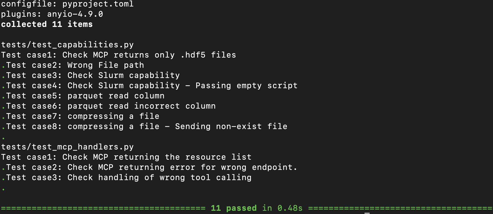

# AOS-MCP
# MCP Tool Implementation

**Name:** Leelavathi Raja  
**Student ID:** A20528208 

---
## Implemented MCP Methods
- `mcp/listResources`: lists implemented capabilities.
- `mcp/callTool`: handles requests of chosen capabilities.

## Implemented Capabilities
### Data
- `HDF5`: Finds all .hdf5 files in the given path.
- `Parquet`: Opens a file & reads a given column of data.
### Tools
- `Slurm`: Mocked Slurm job submission.
- `Compression`: Compress a file using gzip
---

## Create a virtual environment:
```bash
   uv .venv
   uv install
```
## Run Server - terminal 1
```bash
   source .venv/bin/activate
   uvicorn src.server:app --reload
```
## Run Tests - Terminal 2
```bash
   source .venv/bin/activate
   pytest -s
```
## Output


   
