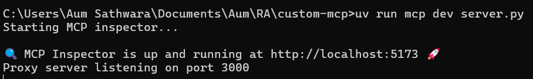

# FileSystem MCP Server

## QuickStart

- Setup uv project
    
    ```bash
    uv init custom-mcp
    cd custom-mcp
    ```
    
- Install mcp[cli] package in custom-mcp directory
    
    ```bash
    uv add "mcp[cli]"
    ```
    
- Create a file called server.py
    
    ```python
    from mcp.server.fastmcp import FastMCP
    from pathlib import Path
    import os
    import base64
    from typing import List
    
    # Initialize the MCP server with the name "FileSystem"
    mcp = FastMCP(name="FileSystem")
    
    # Security configuration
    ALLOWED_DIRS = [Path.cwd()]
    
    def normalize_path(file_path: str) -> Path:
        """Normalize and resolve path with security checks."""
        expanded = Path(os.path.expanduser(file_path))
        resolved = expanded.resolve(strict=False)  # Resolve symlinks
    
        # Validate path components recursively
        for i in range(1, len(resolved.parts) + 1):
            partial = Path(*resolved.parts[:i])
            if partial.is_symlink():
                real_partial = partial.resolve(strict=True)
                if not is_path_allowed(real_partial):
                    raise PermissionError(f"Symlink target restricted: {real_partial}")
    
        return resolved
    
    def is_path_allowed(resolved_path: Path) -> bool:
        """Check if path is within allowed directories."""
        return any(resolved_path.is_relative_to(allowed_dir) for allowed_dir in ALLOWED_DIRS)
    
    def validate_file_operation(path: Path) -> None:
        """Validate path for file operations."""
        parent = path.parent.resolve()
        if not parent.exists():
            raise FileNotFoundError(f"Parent directory does not exist: {parent}")
        if not is_path_allowed(parent):
            raise PermissionError(f"Parent directory not allowed: {parent}")
    
    # Tool to read a file
    @mcp.tool(name="read_file", description="Reads the content of a file")
    async def read_file(file_path: str) -> list:
        """Read file content with binary support."""
        try:
            normalized = normalize_path(file_path)
            if not is_path_allowed(normalized):
                raise PermissionError("Access denied")
    
            with open(normalized, "rb") as f:
                content = f.read()
    
                # Attempt UTF-8 decoding for text files
                try:
                    text_content = content.decode('utf-8')
                    return [{"type": "text", "text": text_content}]
                except UnicodeDecodeError:
                    # Fallback to base64 for binary files
                    return [{"type": "text", "text": base64.b64encode(content).decode('ascii')}]
    
        except Exception as e:
            return [{"type": "text", "text": f"Error: {str(e)}"}]
    
    # Tool to write content to a file
    @mcp.tool(name="write_file", description="Writes content to a file")
    async def write_file(file_path: str, content: str) -> list:
        """Write content to a file with comprehensive validation."""
        try:
            normalized = normalize_path(file_path)
            validate_file_operation(normalized)
    
            if not is_path_allowed(normalized.parent):
                raise PermissionError("Parent directory not whitelisted")
    
            with open(normalized, "a") as f:
                f.write(content)
                return [{"type": "text", "text": "Updated file content successfully"}]
        except Exception as e:
            return [{"type": "text", "text": f"Error: {str(e)}"}]
    
    # Tool to search for files by extension
    @mcp.tool(name="search_file", description="Search for files with a specific extension")
    async def search_file(file_extension: str, search_dir: str = str(Path.cwd())) -> list:
        """Search for files with a specific extension within allowed directories."""
        try:
            resolved_search_dir = normalize_path(search_dir).resolve(strict=True)
    
            if not is_path_allowed(resolved_search_dir):
                return [{"type": "text", "text": "Error: Search directory not in allowed paths"}]
    
            results = [
                str(resolved)
                for resolved in resolved_search_dir.rglob(f"*{file_extension}")
                if is_path_allowed(resolved)
            ]
    
            if not results:
                return [{"type": "text", "text": f"No files found with {file_extension}"}]
    
            return [{"type": "text", "text": "\n".join(results)}]
    
        except Exception as e:
            return [{"type": "text", "text": f"Error: {str(e)}"}]
    
    if __name__ == "__main__":
        mcp.run(transport='stdio')
    
    ```
    

## Verification

- Verify the server.py script is working as intended by either adding tools to Claude Desktop App or check via MCP Inspector

### MCP Inspector

- Once you create server file, run below command to test tools in MCP Inspector
    
    ```bash
    uv run mcp dev server.py
    ```
    
- Click on the link generated
    
    
    
- Click Connect button
    
    
    
- Once Connected, Click on Tools in navigation header and click on List Tools button to see all the tools
    
    
    
- Click on any tool and test it
    
    
    

### Claude Desktop Integration

- Download [Claude Desktop app](https://claude.ai/download)
- Set up desktop app
- Click on File > Settings or press  Ctrl + Comma to open Settings
    
    
    
- Go to Developer tab and Click on Edit Config to open root directory of Claude Desktop app installed location
- Open claude_desktop_config.json in notepad
    
    ```json
    {
        "mcpServers": {
            "FileSystem": {
                "command": "uv",
                "args": [
                    "--directory",
                    "/path/to/your/project_directory",
                    "run",
                    "server.py"
                ]
            }
        }
    }
    ```
    
- Once done save the file and restart Claude Desktop Application to see a hammer shaped icon
    
    
    
- Input below prompt to test search tool
    
    “give me all pdf files present in the directory”
    
    
