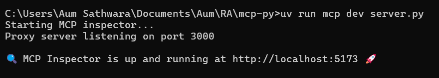

# MCP Python SDK

- Index:
    - [Installation](https://www.notion.so/MCP-Python-SDK-1c5f4544c8d480198c08e7931df8a24e?pvs=21)
    - [**Running the standalone MCP development tools**](https://www.notion.so/MCP-Python-SDK-1c5f4544c8d480198c08e7931df8a24e?pvs=21)
    - [QuickStart](https://www.notion.so/MCP-Python-SDK-1c5f4544c8d480198c08e7931df8a24e?pvs=21)
    - [Citation](https://www.notion.so/MCP-Python-SDK-1c5f4544c8d480198c08e7931df8a24e?pvs=21)

---

## **Installation**

- **Adding MCP to your python project**
    - [UV](https://docs.astral.sh/uv/)
        - What’s UV?
            - A single tool to replace `pip`, `piptools`, `pipx`, `poetry`, `pyenv`, `twine`, `virtualenv`, and more.
            - [10-100x faster](https://github.com/astral-sh/uv/blob/main/BENCHMARKS.md) than `pip`.
        - Installation of UV
            - macOS and Linux
                
                ```bash
                curl -LsSf https://astral.sh/uv/install.sh | sh
                ```
                
            - Windows
                
                ```powershell
                powershell -ExecutionPolicy ByPass -c "irm https://astral.sh/uv/install.ps1 | iex"
                ```
                
        - In a uv managed python project, add mcp to dependencies by:
            
            ```powershell
            uv add "mcp[cli]"
            ```
            
        - Errors you might face:
            - No `pyproject.toml` found in current directory or any parent directory
                - Diagnosis
                    - Have you created a uv managed python project?
                        - If No,
                            
                            ```powershell
                            uv init mcp-py
                            
                            cd mcp-py
                            ```
                            
                            - once done, re run [command](https://www.notion.so/MCP-Python-SDK-1c5f4544c8d480198c08e7931df8a24e?pvs=21)
    - pip
        - To install mcp dependencies
            
            ```bash
            pip install mcp
            ```
            

## **Running the standalone MCP development tools**

To run the mcp command with uv:

```powershell
uv run mcp
```

## Quickstart

- Navigate to mcp-py directory
- Create a file called server.py
    
    ```python
    # server.py
    from mcp.server.fastmcp import FastMCP
    
    # Create an MCP server
    mcp = FastMCP("Demo")
    
    # Add an addition tool
    @mcp.tool()
    def add(a: int, b: int) -> int:
        """Add two numbers"""
        return a + b
    
    # Add a dynamic greeting resource
    @mcp.resource("greeting://{name}")
    def get_greeting(name: str) -> str:
        """Get a personalized greeting"""
        return f"Hello, {name}!"
    ```
    
    - The above file creates a mcp server called “Demo” with a tool called “add” and a resource called “get_greetings”
        - “add” tool takes in two integers and return the addition value of it
        - “get_greeting” takes a string and returns “hello {input string}”
    - Once done, **save the file and hit below command  in the root dir**
        
        ```powershell
        uv run mcp dev server.py
        ```
        
        - It may ask you to download dependencies, in that case press “Y”
        - Else it will return below results
            
            
            
        - Hit the url and you will see a web app as below
            
            
            
            - Hit the **command button and you will see following update**
            
            
            
            - Remember we added a tool called “add” and a resource called “get_greetings”? Let’s fetch it
                - TOOLS
                    - Go to tools section from header and hit “List Tools” button to see the following screen
                        
                        
                        
                        - If success, you will see “add”
                        - Click on add and put any two numbers to test the tool
                        
                        
                        
                - RESOURCES
                    - Go to Resources section from header and click on “List Templates” under Resource Templates pane
                        
                        
                        
                        - If success, it will show get_greeting under it
                        - Click on it and enter your name in right pane
                        
                        
                        
                        - Once done hit “Read Resource” button to get following results
                        
                        
                        
        - Understanding Logs
            - While you performed all the above tasks you might have noticed below logs being created under History Pane
                
                
                
                - Select any one for further analysis (in my case I am selecting tools/list)
                    - When you clicked on List Tools button, the client sends a request as below
                        
                        
                        
                    - The server replies back with all the tools it has
                        
                        
                        
                    - when we select add and input two numbers, the client passes those number as arguments to server
                        
                        
                        
                    - The server replies back with following response
                        
                        
                        

## Citation

https://github.com/modelcontextprotocol/python-sdk?tab=readme-ov-file

https://docs.astral.sh/uv/

https://github.com/astral-sh/uv/blob/main/BENCHMARKS.md