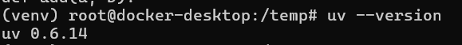

# MCP(s) on IOWarp

### Docker Version

- Installing IOWarp
    - Clone IOWarp Install Repo
        
        ```bash
        cd ${HOME}
        git clone https://github.com/iowarp/iowarp-install.git
        ```
        
    - Create Docker Containers (don’t forget to open docker hub incase if you see docker not found error)
        
        ```bash
        cd ~/iowarp-install/docker
        docker build --no-cache -t iowarp-base . -f iowarp-base.Dockerfile
        docker tag iowarp-base iowarp/iowarp-base:latest
        docker build --no-cache -t iowarp-deps . -f iowarp-deps.Dockerfile
        docker tag iowarp-deps iowarp/iowarp-deps:latest
        docker build --no-cache -t iowarp-user . -f iowarp-user.Dockerfile
        docker tag iowarp-user iowarp/iowarp-user:latest
        ```
        
    - Create Docker Compose Files
        
        ```bash
        mkdir ~/iowarp-docker
        cd ~/iowarp-docker
        nano docker-compose.yml
        ```
        
        - In docker-compose.yml add below
            
            ```bash
            services:
              iowarp:
                image: iowarp/iowarp-user:latest
                container_name: iowarp
                shm_size: 8g
                mem_limit: 8g
                stdin_open: true
                tty: true
                network_mode: host
            ```
            
    - Run docker containers
        
        ```bash
        docker compose up -d  # Only for recent dockers
        docker-compose up -d  # Only for older dockers
        ```
        
    - Access the containers
        
        ```bash
        docker exec -it iowarp bash
        ```
        
- Once IOWarp is installed
    - Install uv  package on docker container
        - Create a new directory
            
            ```bash
            mkdir temp
            cd temp
            ```
            
        - Once in temp dir, create a venv environment
            
            ```bash
            python3 -m venv venv
            ```
            
        - Activate it and pip install package
            
            ```bash
            source venv/bin/activate
            pip install uv
            ```
            
        - check if it’s installed by
            
            ```bash
            uv --version
            ```
            
            - Expected output:
                
                
                
        - Once installed do following to install
            - To install MCPs
                
                ```bash
                uv pip install "git+https://github.com/aumsathwara/MCP.git@multiple-mcps"
                ```
                
            - To install FileSystem MCP (only)
                
                ```bash
                uv pip install "git+https://github.com/aumsathwara/MCP.git@multiple-mcps#subdirectory=FileSystem-MCP"
                ```
                
            - To install Weather MCP (only)
                
                ```bash
                uv pip install "git+https://github.com/aumsathwara/MCP.git@multiple-mcps#subdirectory=Weather-MCP"
                ```
                

### Test Filesystem MCP

FileSystem MCP package already comes prebuilt with a server and client. Once you install FileSystem package, all you need is a [Gemini API key](https://ai.google.dev/gemini-api/docs/api-key) 

To test FileSystem Client [Integrated with Gemini]

- Create a .env file in temp folder
    
    ```bash
    nano .env
    ```
    
- Inside env file, create an environment variable “GEMINI_API_KEY”, and save it
    
    ```bash
    GEMINI_API_KEY = {YOUR GEMINI API KEY}
    ```
    
- cat .env just to verify
- Once done, all you need to do is
    
    ```bash
    fs-mcp-client fs-mcp-server
    ```
    
    - This will show below outputs
        
        
        
    - Ask queries like
        - List all python files in current directory
        - Create a python file called add.py which takes two integers as input and returns summation of it
        - Read add.py in current directory

To test FileSystem Server 

- Simply execute below
    
    ```bash
     fs-mcp-server
    ```