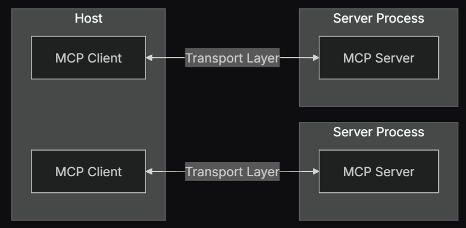

# MCP Glossary

## TLDR

- MCP is a protocol that is a set of rules that **standardizes** how LLMs connect with external sources of information.

## History

### Before MCP?

- Before MCP there was Language Server Protocol (LSP).
    - LSP →  standard for how integrated development environments (IDEs) communicate with language-specific tools.  LSP allows any IDE that supports it to seamlessly integrate with various programming languages.
- Inspired by LSP, MCP overcomes the MxN integration problem we see with language model integrations, where each new language model (M) requires custom connectors and prompts to interface with each enterprise tool (N). By adopting MCP, both models and tools conform to a common interface, reducing the integration complexity from M×N to M+N.

### Why M+N?

- Provides **Standardization**, and we don’t need to maintain a different connector for each data source.
- For AI applications that intend to preserve contextual information while navigating across various sources of information in their tool and data stack, ***standardization allows us to transition towards building systems that are more robust and scalable.***

## Architecture of MCP

### Components of MCP

- HOST
- CLIENT
- SERVER

- Host → are LLM applications (like Claude Desktop or IDEs) that initiate connections
- **Clients** → maintain 1:1 connections with servers, inside the host application.
    - Intermediary that manages secure connections between host and servers, with one client per server for isolation. The Client is in the host application.
- **Servers** → provide context, tools, and prompts to clients
    - External program providing specific capabilities (tools, data access, domain prompts) that connects to various data sources like Google Drive, Slack, GitHub, databases, and web browsers.

### Server-Side Primitives

| **Feature** | [**Tools**](https://modelcontextprotocol.io/docs/concepts/tools) | [**Resources**](https://modelcontextprotocol.io/docs/concepts/resources) | [**Prompts**](https://modelcontextprotocol.io/docs/concepts/prompts) |
| --- | --- | --- | --- |
| **Function** | Enables servers to expose executable functionality to clients | Allows servers to expose data and content that can be read by clients and used as context for LLM interactions | Predefined templates and workflows that servers can define for standardized LLM interactions |
| **Control Type** | Model-controlled | Application-controlled | User-controlled |
| **Control Meaning** | Tools are exposed from servers to clients; they represent dynamic operations that can be invoked by the LLM and modify state or interact with external systems. | Client application decides how and when resources should be used | Prompts are exposed from servers to clients with the intention of the user |

### Client-Side Primitives

- Roots
    - Specific location within the host’s file system or environment that the server is authorized to interact with
    - Roots define the boundaries where servers can operate and allow clients to inform servers about relevant resources and their locations.
- Sampling
    - Gives clients full control over model selection, hosting, privacy, and cost management.
    - Allows MCP servers to request LLM completions from the client
    - Servers can request specific inference parameters like model preferences, system prompts, temperature settings, and token limits, while clients maintain the authority to decline potentially malicious requests or limit resource usage.

### Citation

https://www.digitalocean.com/community/tutorials/model-context-protocol

https://modelcontextprotocol.io/docs/concepts/architecture#overview

https://www.anthropic.com/engineering/building-effective-agents