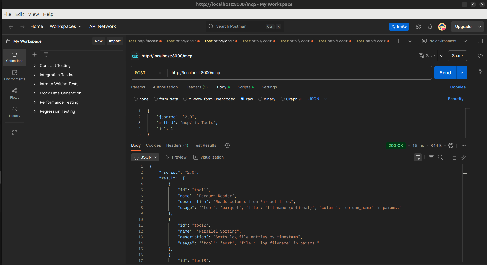

# MCP Server Implementation

## MCP Capabilities

**Parquet Handler**
- Reads specific columns from .parquet files using PyArrow (pyarrow must be installed)
- Expects valid file paths and column names
- Supports error handling for:
  - Non-existent files
  - Missing or incorrect column names


## Environment Setup (Linux)

1. Install uv:
```bash
pip install uv
```

2. Create and activate environment using uv:
```bash
uv venv mcp-server
source mcp-server/bin/activate
```

3. Install dependencies using uv:
```bash
# Install dependencies from pyproject.toml
uv pip install --requirement pyproject.toml
```

Dependencies are specified in pyproject.toml:
```toml
[project]
name = "mcp_server"
version = "0.1.0"
dependencies = [
    "fastapi>=0.115.12",
    "numpy>=2.2.4",
    "pandas>=2.2.3",
    "pyarrow>=19.0.1",
    "pydantic>=2.11.3",
    "pytest>=8.3.5",
    "pytest-asyncio==0.26.0",
    "requests>=2.32.3",
    "uvicorn>=0.34.1",
]

python = ">=3.10"
```

## Running the MCP Server

1. Ensure you're in the virtual environment
2. Start the FastAPI server using uvicorn:
```bash
uvicorn src.server:app --reload --host 0.0.0.0 --port 8000
```

The server will start on `http://localhost:8000` by default.

## Running Tests

Run all tests:
```bash
python3 -m pytest
```


Run specific test files:
```bash
python3 -m pytest tests/test_sort_handler.py
python3 -m pytest tests/test_parquet_handler.py
python3 -m pytest tests/test_compression_handler.py
python3 -m pytest tests/test_pandas_handler.py
```

## Project Structure
```
MCP-Server/
├── src/
│   ├── capabilities/
│   │   ├── __init__.py
│   │   ├── parquet_handler.py
│   ├── __init__.py
│   ├── mcp_handlers.py
|   └── server.py
├── tests/
│   ├── __init__.py
│   ├── test_parquet_handler.py
├── data/
├── images/
├── README.md
├── pyproject.toml
└── pytest.ini
```

## JSON-RPC Requests and Responses

### 1. List Resources


Request:
```json
{
    "jsonrpc": "2.0",
    "method": "mcp/listResources",
    "id": 1
}
```

Response:
```json
{
    "jsonrpc": "2.0",
    "result": [
        {
            "id": "resource1",
            "name": "Weather Data",
            "type": "Parquet",
            "description": "Weather measurements including temperature, humidity, and pressure",
            "path": "data/weather_data.parquet",
            "format": "parquet",
            "columns": ["temperature", "humidity", "pressure", "timestamp"]
        },
        {
            "id": "resource2",
            "name": "System Logs",
            "type": "Log",
            "description": "System event logs with timestamps",
            "path": "data/huge_log.txt",
            "format": "text",
            "schema": "timestamp:string message:string level:string"
        },
        {
            "id": "resource3",
            "name": "Student Records",
            "type": "CSV",
            "description": "Student academic records with marks",
            "path": "data/data.csv",
            "format": "csv",
            "columns": ["id", "name", "subject", "marks"]
        },
        {
            "id": "resource4",
            "name": "Application Logs",
            "type": "Log",
            "description": "Application startup and runtime logs with timestamps and log levels",
            "path": "data/output.log",
            "format": "text",
            "schema": "timestamp:string level:string message:string",
            "sample": "[2024-03-16 00:00:15] INFO: Application startup"
        }
    ],
    "id": 1
}
```

### 2. Get Resource


Request:
```json
{
    "jsonrpc": "2.0",
    "method": "mcp/getResource",
    "params": {
        "id": "resource1"
    },
    "id": 1
}
```

Response:
```json
{
    "jsonrpc": "2.0",
    "result": {
        "id": "resource1",
        "name": "Weather Data",
        "type": "Parquet",
        "description": "Weather measurements including temperature, humidity, and pressure",
        "path": "data/weather_data.parquet",
        "format": "parquet",
        "columns": ["temperature", "humidity", "pressure", "timestamp"]
    },
    "id": 1
}
```

### 3. List Available Tools



Request:
```json
{
    "jsonrpc": "2.0",
    "method": "mcp/listTools",
    "id": 1
}
```

Response:
```json
{
    "jsonrpc": "2.0",
    "result": [
        {
            "id": "tool1",
            "name": "Parquet Reader",
            "description": "Reads columns from Parquet files",
            "usage": "'tool': 'parquet', 'file': 'filename (optional)', 'column': 'column_name' in params."
        },

    ],
    "id": 1
}
```

### 4. Read Parquet Data


Request:
```json
{
    "jsonrpc": "2.0",
    "method": "mcp/callTool",
    "params": {
        "tool": "parquet",
        "column": "temperature"
    },
    "id": 2
}
```

Response:
```json
{
    "jsonrpc": "2.0",
    "id": 2,
    "result": [
        14.96,
        2.01,
        0.56,
        16.19,
        30.18,
        "..."
    ]
}
```

